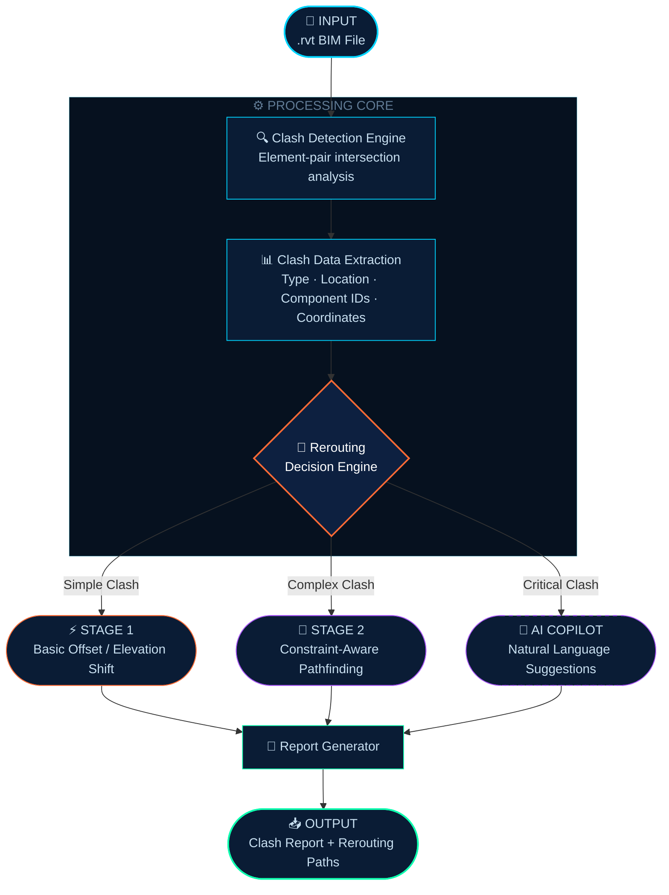

<div align="center">

<!-- HERO BANNER -->


<br/>

<!-- TYPING ANIMATION -->


<br/><br/>

<!-- BADGES ROW 1 -->
[](.)&nbsp;
[](.)&nbsp;
[](.)

<!-- BADGES ROW 2 -->
[](.)&nbsp;
[](.)&nbsp;
[](.)

<br/>

```
╔══════════════════════════════════════════════════════════════════╗
║                                                                  ║
║    Resolving MEP conflicts before they reach the job site.       ║
║    Turning complex BIM coordination into automated intelligence. ║
║                                                                  ║
╚══════════════════════════════════════════════════════════════════╝
```

</div>

<br/>

---

## 🧭 Navigation

<div align="center">

[📌 Overview](#-overview) &nbsp;·&nbsp; [⚠️ Problem](#%EF%B8%8F-the-problem) &nbsp;·&nbsp; [🔍 Clash Types](#-clash-types) &nbsp;·&nbsp; [⚙️ Architecture](#%EF%B8%8F-system-architecture) &nbsp;·&nbsp; [🧪 Roadmap](#-development-roadmap) &nbsp;·&nbsp; [🚀 Future](#-future-vision) &nbsp;·&nbsp; [👥 Team](#-the-team)

</div>

---

## 📌 Overview

<table>
<tr>
<td width="65%">

**MEP Clash Detection & Rerouting** is an AI-assisted BIM coordination platform that automatically detects and resolves conflicts in **Mechanical, Electrical, and Plumbing** systems — *before* they become expensive on-site mistakes.

Built for BIM coordinators and MEP engineers who demand **speed, precision, and automation** in their design workflows.

**Core capabilities:**
- 🔍 Automated clash detection across all MEP disciplines
- 🔁 Intelligent rerouting with constraint awareness
- 📄 Structured reports with clash location & severity
- 🧠 AI priority scoring *(planned)*

</td>
<td width="35%" align="center">

```
  ┌───────────────┐
  │   .rvt File   │
  │   BIM Model   │
  └──────┬────────┘
         │
         ▼
  ┌───────────────┐
  │    DETECT     │  ← Clash Engine
  └──────┬────────┘
         │
         ▼
  ┌───────────────┐
  │    REROUTE    │  ← AI Logic
  └──────┬────────┘
         │
         ▼
  ┌───────────────┐
  │    REPORT     │  ← Output
  └───────────────┘
```

</td>
</tr>
</table>

---

## ⚠️ The Problem

> In traditional MEP coordination, clashes are discovered **late** — often on the construction site — leading to costly rework, schedule delays, and design conflicts between disciplines.

<br/>

<div align="center">

| | Without This System | With This System |
|:---:|:---|:---|
| 🔴 | Manual clash detection in Revit / Navisworks | ✅ Automated detection in seconds |
| 🔴 | Hours of cross-discipline coordination | ✅ Instant multi-system analysis |
| 🔴 | Human error in complex MEP overlaps | ✅ Consistent, algorithmic accuracy |
| 🔴 | Expensive rework discovered on-site | ✅ Issues resolved at the design stage |
| 🔴 | No prioritization of critical clashes | ✅ AI-powered severity scoring *(planned)* |

</div>

---

## 🔍 Clash Types

<div align="center">

```
╔══════════════╦══════════════════╦══════════════╦══════════════════════════════════════════════╗
║   INDICATOR  ║   CLASH TYPE     ║   SEVERITY   ║   DESCRIPTION                                ║
╠══════════════╬══════════════════╬══════════════╬══════════════════════════════════════════════╣
║      🔴      ║  Pipe – Pipe     ║  HARD CLASH  ║  Physical overlap between plumbing pipes     ║
║      🟦      ║  Duct – Duct     ║  HARD CLASH  ║  Overlapping HVAC ductwork sections          ║
║      🟠      ║  Pipe – Duct     ║ INTER-SYSTEM ║  Cross-discipline: plumbing vs. mechanical   ║
║      🟡      ║  Cable Tray      ║  SOFT CLASH  ║  Electrical tray violates MEP clearances     ║
║      🟣      ║  Inter-System    ║   COMPLEX    ║  Multi-discipline conflicts across all MEP   ║
╚══════════════╩══════════════════╩══════════════╩══════════════════════════════════════════════╝
```

</div>

---

## ⚙️ System Architecture



---

## 📂 Input & Output

<table>
<tr>
<td width="50%">

### 📥 Input Specification

```yaml
# ─────────────────────────────────
#  ACCEPTED INPUT FORMAT
# ─────────────────────────────────

format:      .rvt  (Autodesk Revit BIM)
disciplines:
  - Mechanical   # HVAC, ductwork, AHUs
  - Electrical   # Cable trays, conduits
  - Plumbing     # Pipes, fittings, valves

metadata:
  - Coordinate reference system
  - Level & grid definitions
  - Element parameter data
```

</td>
<td width="50%">

### 📤 Output Specification

```yaml
# ─────────────────────────────────
#  GENERATED OUTPUT
# ─────────────────────────────────

clash_report:
  - clash_type: HARD | SOFT | INTER-SYSTEM
  - severity:   CRITICAL | MAJOR | MINOR
  - location:   { x, y, z } coordinates
  - components: [ element_id_A, element_id_B ]

rerouting:
  - suggested_path: offset / elevation shift
  - constraint_check: clearance & code pass
  - ai_priority_score: planned 🧠

export_formats:
  - Structured PDF report
  - HTML visual dashboard
```

</td>
</tr>
</table>

---

## 🧪 Development Roadmap

### 🟠 Stage 1 — Core Detection Engine &nbsp; `In Progress`

<div align="center">

```
Progress ━━━━━━━━━━━━━━━━━━━━━━━━━━━━━━━━━━░░░░░░░░░  80%
```

</div>

| Status | Task |
|:------:|:-----|
| ✅ | Parse and extract clash data from `.rvt` Revit models |
| ✅ | Detect and classify clash types — hard, soft, inter-system |
| ✅ | Output clash type, location (XYZ), and affected component IDs |
| ✅ | Apply basic offset/elevation-shift rerouting for simple clashes |
| 🔄 | Cover all simple clash scenario variations end-to-end |

<br/>

### 🟣 Stage 2 — Intelligent Rerouting Engine &nbsp; `Planned`

<div align="center">

```
Progress ░░░░░░░░░░░░░░░░░░░░░░░░░░░░░░░░░░░░░░░░░░░   0%
```

</div>

| Status | Task |
|:------:|:-----|
| ⬜ | Handle full-scale production BIM models (100,000+ elements) |
| ⬜ | Constraint-aware rerouting respecting codes, structure & clearances |
| ⬜ | Batch multi-clash optimization — resolve cascading conflicts |
| ⬜ | Minimize disruption to surrounding design elements |

---

## ⚠️ Engineering Challenges

<table>
<tr>
<td width="33%" align="center">

```
┌────────────────────┐
│  01  COMPLEXITY    │
└────────────────────┘
```

Revit models contain **deeply nested parametric relationships**. Robust parsing requires understanding the full Revit API object graph — families, instances, geometry, and constraints.

</td>
<td width="33%" align="center">

```
┌────────────────────┐
│  02  REROUTING     │
└────────────────────┘
```

Rerouted paths must comply with **building codes, structural limits, and MEP clearance standards** — not just avoid geometric overlap.

</td>
<td width="33%" align="center">

```
┌────────────────────┐
│  03  PERFORMANCE   │
└────────────────────┘
```

Real-world models exceed **100,000+ elements**. Clash detection must run at scale without sacrificing accuracy or introducing false positives.

</td>
</tr>
</table>

---

## 🚀 Future Vision

<div align="center">

```
┌─────────────────────────────────────────────────────────────────────────────┐
│                         FUTURE ENHANCEMENT PIPELINE                         │
├───────────────────┬─────────────────────────────────────────────────────────┤
│  ⚡ REAL-TIME     │  Live clash detection as elements are placed in Revit    │
├───────────────────┼─────────────────────────────────────────────────────────┤
│  🤖 AUTO-RESOLVE  │  Zero-touch resolution for common clash patterns         │
├───────────────────┼─────────────────────────────────────────────────────────┤
│  🧠 AI COPILOT    │  Prompt-based MEP solutions from natural language input  │
├───────────────────┼─────────────────────────────────────────────────────────┤
│  📊 SMART SCORING │  AI scoring by severity, cost impact & schedule risk     │
├───────────────────┼─────────────────────────────────────────────────────────┤
│  🔗 NAVISWORKS    │  Native export to NWD / NWF clash test formats           │
├───────────────────┼─────────────────────────────────────────────────────────┤
│  ☁️ CLOUD COLLAB  │  Multi-user real-time coordination dashboard             │
└───────────────────┴─────────────────────────────────────────────────────────┘
```

</div>

---

## 👥 The Team

<div align="center">

<br/>

| &nbsp; | Name | Role | Focus Area |
|:------:|:-----|:-----|:-----------|
| 🔵 | **Karan Mishra** | Core Developer | Clash detection engine & Revit API integration |
| 🟠 | **Anup Mehta** | Systems Architect | System design, data pipeline & performance |
| 🟢 | **Aakash Kavediya** | BIM Specialist | MEP workflows, model validation & standards |
| 🟣 | **Shlok Khade** | AI Integration | Rerouting intelligence & AI prioritization |

<br/>

</div>

---

<div align="center">


```
  ◈  Practical  ·  Scalable  ·  Intelligent  ◈
```

*Designed to mirror real-world BIM coordination workflows —*
*from first clash detection to construction-ready resolution.*

<br/>


</div>
