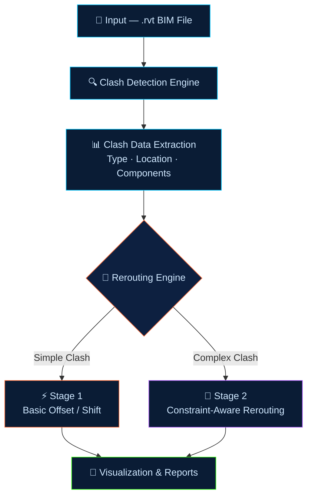

<div align="center">

# 🏗️ MEP Clash Detection & Rerouting System
### AI-Assisted BIM Coordination Platform

`🔍 Detect` &nbsp;·&nbsp; `🔁 Reroute` &nbsp;·&nbsp; `📄 Report` &nbsp;·&nbsp; `🧠 AI-Powered`

---

*Stage 1: Active Development &nbsp;|&nbsp; Input: `.rvt` Revit &nbsp;|&nbsp; AI Assistant: Planned*

</div>

---

## 📌 Overview

> An **AI-assisted BIM coordination platform** that automatically detects and resolves clashes in MEP (Mechanical, Electrical, Plumbing) systems. Leverages industry-standard workflows enhanced with **intelligent rerouting** and automation.

---

## ⚠️ Problem Statement

<table>
<tr>
<td width="50%">

**😟 Without This System**

- ❌ Manual clash detection
- ❌ Time-consuming coordination
- ❌ Error-prone processes
- ❌ Costly rework on-site

</td>
<td width="50%">

**✅ With This System**

- ✅ Automated clash detection
- ✅ Intelligent rerouting
- ✅ Improved design accuracy
- ✅ Reduced construction errors

</td>
</tr>
</table>

---

## 🔍 Clash Detection Types

| &nbsp; | Clash Type | Category | Description |
|:---:|:---|:---:|:---|
| 🔴 | **Pipe – Pipe** | `HARD CLASH` | Physical overlap between plumbing pipe segments |
| 🟦 | **Duct – Duct** | `HARD CLASH` | Overlapping HVAC ductwork sections |
| 🟠 | **Pipe – Duct** | `INTER-SYSTEM` | Cross-system clash: plumbing vs mechanical |
| 🟡 | **Cable Tray** | `SOFT CLASH` | Electrical tray conflicts with MEP elements |
| 🟣 | **Inter-System** | `COMPLEX` | Multi-discipline conflicts across all MEP categories |

---

## ⚙️ System Workflow



---

## 📂 Input & Output

<table>
<tr>
<td width="50%">

**📥 Input**
```
📐  .rvt  — Autodesk Revit BIM Models
🏗️  Full MEP discipline models
📡  Coordinate system metadata
```

</td>
<td width="50%">

**📤 Output**
```
⚠️  Clash type, location & coordinates
🔁  Suggested rerouting paths
📄  Automated structured reports
🧠  AI priority assignments (planned)
```

</td>
</tr>
</table>

---

## 🧪 Implementation Stages

<table>
<tr>
<td width="50%">

**🟠 Stage 1 — Basic** &nbsp;`In Development`

- [x] Detect clashes in provided model
- [x] Display type, location & components
- [x] Apply basic offset/shift rerouting
- [ ] Cover all simple clash scenarios

</td>
<td width="50%">

**🟣 Stage 2 — Advanced** &nbsp;`Planned`

- [ ] Process full-scale BIM models
- [ ] Constraint-aware intelligent rerouting
- [ ] Minimize disruption to existing design
- [ ] Multi-clash optimization engine

</td>
</tr>
</table>

---

## ⚠️ Challenges

| # | Challenge | Details |
|:---:|:---|:---|
| 1️⃣ | **BIM Data Complexity** | Revit models have deeply nested parametric relationships requiring robust parsing |
| 2️⃣ | **Realistic Rerouting Logic** | Paths must comply with building codes, structural constraints & MEP standards |
| 3️⃣ | **Large-Scale Performance** | Real-world models contain 100,000+ elements — accuracy at scale is critical |

---

## 🏆 Future Enhancements

| &nbsp; | Feature | Description |
|:---:|:---|:---|
| ⚡ | **Real-Time Detection** | Live clash detection as elements are placed in the design environment |
| 🤖 | **Fully Automated Rerouting** | Zero-touch resolution for common clash patterns |
| 🧠 | **AI Design Copilot** | Prompt-based MEP solutions from natural language input |
| 📊 | **Smart Prioritization** | AI scoring by severity, cost impact & schedule risk |

---

## 👥 Team Visionaries

<div align="center">

| Name | Role |
|:---|:---|
| **Karan Mishra** | Core Developer |
| **Anup Mehta** | Systems Architect |
| **Aakash Kavediya** | BIM Specialist |
| **Shlok Khade** | AI Integration |

</div>

---

<div align="center">

`Practical` &nbsp;·&nbsp; `Scalable` &nbsp;·&nbsp; `Intelligent`

> 📌 Designed to follow **real-world BIM coordination workflows**

</div>
