<p align="center">
  
</p>

<p align="center">
  
</p>

<p align="center">
  
  
  
  
  
  
</p>

<p align="center">
  
</p>

## Overview

Visionaries Orchathon is an end-to-end BIM analytics and clash-resolution platform that converts building model data into actionable engineering decisions.

Instead of stopping at clash detection, this project moves further to:

- classify service systems,
- detect conflicts in 3D space,
- rank severity,
- suggest rerouting moves,
- generate machine-readable outputs for downstream apps and reporting.

## Final Goal

The final goal is to deliver a practical coordination engine where teams can go from raw BIM input to a prioritized, explainable resolution plan in one workflow.

In short: **from model complexity to construction-ready clarity**.

## What Makes This Project Different

- **Not just extraction**: full pipeline from IFC parsing to clash intelligence.
- **Not just detection**: includes fix strategy generation and reasoning.
- **Not just backend scripts**: includes API delivery and frontend visualization.
- **Not just one output**: creates multiple artifacts for QA, reports, and integration.

---

## End-to-End Process

### Stage 1: BIM Data Ingestion and Enrichment

- Parse IFC model metadata, hierarchy, properties, and quantities.
- Compute geometric extents (bounding boxes) for spatial analysis.
- Normalize object records with IDs, naming, storey context, and attributes.

### Stage 2: MEP Semantic Extraction

- Extract MEP entities broadly via `IfcDistributionElement` inheritance.
- Fallback to explicit MEP classes for schema compatibility.
- Flatten property dictionaries for easier geometric and rule-based checks.

### Stage 3: Clash Detection

- Build AABB geometry per element.
- Perform pairwise overlap checks.
- Prioritize movable vs fixed element using routing priority rules.
- Propose offset direction (`UP`, `DOWN`, `NORTH`, `SOUTH`, `EAST`, `WEST`) and target position.

### Stage 4: Rule-Engine Validation and Resolution Scoring

- Apply engineering rules and standards-aware checks.
- Evaluate multiple rerouting strategies.
- Validate cascade impacts against neighboring elements.
- Rank candidate resolutions by feasibility and severity reduction.

### Stage 5: Output and Reporting

- Persist structured JSON/CSV artifacts.
- Feed data into frontend and report layers.
- Support review workflows and future automation.

---

## Architecture

```mermaid
flowchart LR
    A[IFC or RVT Input] --> B[Python Processing Layer]
    B --> C[MEP Extraction]
    C --> D[Clash Detection Engine]
    D --> E[Rule Engine and Resolution Ranking]
    E --> F[JSON and CSV Outputs]
    F --> G[Flask API]
    G --> H[Next.js BIM Fixer UI]

    style A fill:#e0f2fe,stroke:#0284c7,stroke-width:2px,color:#0c4a6e
    style B fill:#ecfeff,stroke:#0f766e,stroke-width:2px,color:#134e4a
    style C fill:#f0fdfa,stroke:#0d9488,stroke-width:2px,color:#134e4a
    style D fill:#fff7ed,stroke:#ea580c,stroke-width:2px,color:#7c2d12
    style E fill:#fffbeb,stroke:#ca8a04,stroke-width:2px,color:#713f12
    style F fill:#f5f3ff,stroke:#7c3aed,stroke-width:2px,color:#4c1d95
    style G fill:#eef2ff,stroke:#4f46e5,stroke-width:2px,color:#312e81
    style H fill:#f0f9ff,stroke:#0369a1,stroke-width:2px,color:#082f49
```



---

## Repository Map

```text
Visionaries_Orchathon/
|- process_bim_data.py        # IFC + XML merge and dataset generation
|- requirements.txt           # Root python dependencies
|- output/                    # Generated JSON artifacts
|- stage2/                    # Stage-2 extraction and clash run artifacts
|- stages/                    # Rule-engine and report generation scripts
|- prototype/                 # Flask backend + MEP and clash modules
|- bim_fixer/                 # Next.js frontend interface
`- extra/                     # Lightweight static UI prototype
```

---

## Key Output Artifacts

| Folder | Artifact | Purpose |
|---|---|---|
| `output/` | `ifc_full_data.json` | Full extracted IFC object data |
| `output/` | `clash_full_data.json` | Parsed clash dataset |
| `output/` | `merged_dataset.json` | IFC + clash merged view |
| `output/` | `id_mapping.json` | Cross-reference mapping between systems |
| `output/` | `unmatched_clashes.json` | Clashes with unresolved IDs |
| `output/` | `unmatched_ifc.json` | IFC elements not linked in clash reports |
| `stage2/` | `extracted_elements.json` | Stage-wise extracted elements |
| `stage2/` | `clash_results.json` | Stage-wise clash output |
| `stage2/` | `run_manifest.json` | Run metadata and provenance |
| `stages/` | `clash_rule_engine_report.json` | Rule-engine recommendations and scoring |
| `stages/` | `clash_results.csv` | Tabular clash summary |
| `stages/` | `report.html` | Human-readable report page |

---

## API Snapshot (Prototype Backend)

| Method | Endpoint | Purpose |
|---|---|---|
| `POST` | `/api/convert` | Upload RVT and generate IFC output filename |
| `GET` | `/download/<filename>` | Download converted IFC |
| `GET` | `/api/mep-data/<filename>` | Extract and return MEP elements from IFC |
| `GET` | `/api/clash-data/<filename>` | Run clash detection and return clash payload |

### Example Response: Clash Endpoint

```json
{
  "status": "success",
  "filename": "sample.ifc",
  "clash_count": 21,
  "mep_element_count": 164,
  "clashes": [
    {
      "clash_id": "Clash1",
      "move_element_type": "PIPE",
      "fixed_element_type": "DUCT",
      "strategy": "OFFSET",
      "direction": "UP"
    }
  ]
}
```

---

## Quick Start

### 1) Python Environment

```powershell
python -m venv .backend
.\.backend\Scripts\Activate.ps1
pip install -r requirements.txt
```

### 2) Run Flask Backend

```powershell
cd prototype
pip install -r requirements.txt
python app.py
```

Backend runs at: `http://localhost:5000`

### 3) Run Next.js Frontend

```powershell
cd bim_fixer
npm install
npm run dev
```

Frontend runs at: `http://localhost:3000`

### 4) Optional: Serve Static Prototype

```powershell
cd extra
python -m http.server 8000
```

Static preview: `http://localhost:8000/index.html`

---

## Detailed Engineering Notes

<details>
<summary><strong>MEP Extraction Strategy</strong></summary>

- Parent-class capture via `IfcDistributionElement` for broad IFC4 coverage.
- Explicit class fallback for IFC2X3/partial exports.
- Enriched records include:
  - geometry/location,
  - flattened property sets,
  - materials,
  - system assignments,
  - spatial containment,
  - connected elements.

</details>

<details>
<summary><strong>Clash Strategy</strong></summary>

- Bounding boxes generated using dimensional heuristics from MEP properties.
- Pairwise overlap identifies hard clashes.
- Priority matrix decides movable element.
- Resolution candidate computed with minimal offset and clearance margin.
- Explanatory reason string included for traceability.

</details>

<details>
<summary><strong>Rule Engine (Advanced Stage)</strong></summary>

- Multi-strategy rerouting exploration.
- Post-move validation against neighbors.
- Cascade clash impact tracking.
- Severity model and recommendation ranking.
- Standards-aligned constraints integrated in decision logic.

</details>

---

## Current Strengths

- Strong data pipeline from parsing to actionable output.
- Practical clash handling with strategy reasoning.
- Clean separation of processing, API, and frontend layers.
- Multiple artifacts for analytics, debugging, and reporting.

## Current Gaps

- Full RVT conversion still depends on converter implementation details.
- Real-time collaborative review is not yet active.
- Automated 3D in-browser clash visualization can be expanded.

---

## Roadmap

- [ ] Interactive 3D clash viewer with highlighted conflict pairs.
- [ ] Smarter recommendation scoring with simulation-based checks.
- [ ] Incremental model updates and diff-based clash reruns.
- [ ] Collaboration workflow (comments, assignment, approval states).
- [ ] CI pipeline for validation, linting, and regression checks.

---

## Contribution Guide

Contributions are welcome across:

- parsing accuracy,
- clash quality,
- rule-engine intelligence,
- API robustness,
- frontend usability,
- documentation quality.

Suggested workflow:

1. Create a feature branch.
2. Keep commits scoped and descriptive.
3. Add sample output updates when behavior changes.
4. Open a pull request with before/after evidence.

---

## License

This project is distributed under the MIT License. See `LICENSE` for details.

---

<p align="center">
  
</p>

<p align="center">
  <strong>Visionaries Orchathon</strong><br/>
  Turning BIM complexity into confident engineering decisions.
</p>
